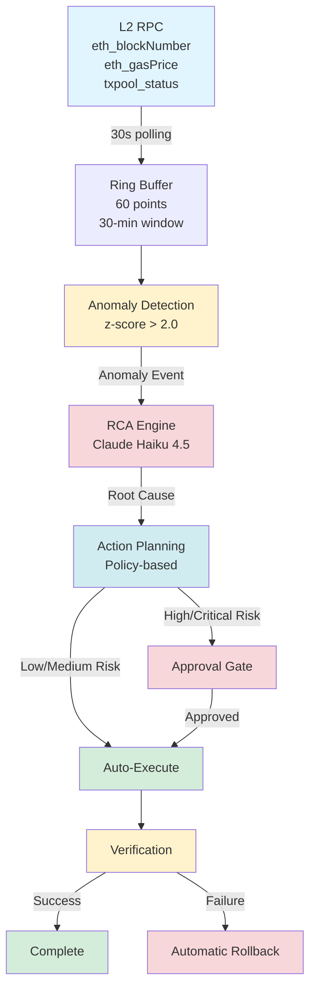

# SentinAI Whitepaper

**Autonomous Operations for Layer 2 Rollup Infrastructure**

Version 1.0 | February 2026

---

## Executive Summary

As Layer 2 rollup infrastructure grows in complexity, manual operational oversight becomes increasingly untenable. **SentinAI** is an autonomous node guardian designed specifically for Optimism-based rollup infrastructure, combining real-time telemetry, AI-powered anomaly detection, and policy-governed execution to detect, diagnose, and remediate operational issues with minimal human intervention.

Unlike black-box autopilots, SentinAI implements a **safety-first autonomy model**: low-risk actions execute automatically, high-risk operations require explicit approval, and every decision is auditable.

---

## Key Highlights

### 🎯 Problem We Solve

Modern L2 rollup deployments face:
- **Operational complexity**: Multiple interdependent components (op-geth, op-node, op-batcher, op-proposer)
- **High MTTR**: 30-60 minutes average response time with manual operations
- **Inconsistent execution**: Remediation quality varies by operator experience
- **24/7 burden**: Service degradation during off-hours

### 🛡️ Our Approach: Governed Autonomy

**Safety-First Design**:
- Hard-coded blacklist prevents destructive actions
- Risk-tiered execution (Low/Medium/High/Critical)
- Default dry-run mode for testing

**Policy-Over-Model Execution**:
- Explainable decision trees augmented by AI
- No opaque black-box models
- Graceful degradation when AI unavailable

**Auditability by Default**:
- Every decision logged with reasoning
- Exportable audit trails for compliance
- Post-mortem analysis support

### 🏗️ System Architecture

**Six Core Subsystems**:

1. **Telemetry Collector**: Aggregate metrics from L2 RPC, Kubernetes API, component logs
2. **Anomaly Detection**: Statistical (z-score) + AI log analysis (Claude Haiku 4.5)
3. **Root Cause Analysis**: AI-guided diagnosis with human-readable reasoning
4. **Predictive Scaling**: Time-series forecasting for proactive resource allocation
5. **Action Planning & Execution**: Risk-based policy framework with automatic rollback
6. **MCP Integration**: External AI agent access (Claude Desktop, Claude Code)

**System Data Flow**:

### 🔒 Risk & Control Framework

| Risk Tier | Auto-Execute | Approval | Cooldown | Examples |
|-----------|--------------|----------|----------|----------|
| **Low** | ✓ | ✗ | 5 min | CPU 1→2 vCPU |
| **Medium** | ✓ | ✗ | 5 min | Component restart |
| **High** | ✗ | ✓ | 10 min | Downscale 4→1 vCPU |
| **Critical** | ✗ | ✓ (Multi) | 30 min | DB operations |

**Forbidden Actions** (Hard-coded):
- `DROP DATABASE`
- Table-wide `DELETE`
- `kubectl delete namespace/serviceaccount`
- `kubectl exec` without approval

### 📈 Case Studies

**1. Sync Stall Recovery**
- **Incident**: op-node fell 50 blocks behind L1
- **Detection**: blockInterval anomaly (4.2s → 12.8s, z=4.1)
- **Action**: Auto-restart op-node
- **Result**: MTTR 3.4 min vs. 45 min baseline ✅

**2. Batcher Congestion**
- **Incident**: L1 gas spike delayed batch submissions
- **Detection**: txPoolCount anomaly (23 → 187, z=3.8)
- **Action**: Increase gas budget (approval required)
- **Result**: MTTR 12 min vs. 60 min baseline ✅

**3. CPU Pressure Scaling**
- **Incident**: CPU spike to 89% during traffic surge
- **Detection**: cpuUsage anomaly (45% → 89%, z=3.5)
- **Action**: Auto-scale to 4 vCPU
- **Result**: MTTR 2.8 min, prevented degradation ✅

---

## Full Whitepaper (Academic Version)

For the complete technical whitepaper with detailed architecture, evaluation methodology, security analysis, and roadmap:

  

    📄 <strong>Complete Whitepaper (PDF)</strong>
  

  

    Professional academic format with mathematical notation, detailed sections, and comprehensive analysis
  

  <a 
    href="https://github.com/tokamak-network/SentinAI/raw/main/docs/whitepaper.pdf" 
    download
    style="display: inline-block; padding: 12px 32px; background: white; color: #667eea; text-decoration: none; border-radius: 6px; font-weight: 600; transition: transform 0.2s;"
    onmouseover="this.style.transform='scale(1.05)'"
    onmouseout="this.style.transform='scale(1)'"
  >
    ⬇️ Download Whitepaper (PDF)
  </a>

**Sections in Full Whitepaper**:
1. Problem Statement (Operational complexity, manual limits, autopilot dilemma)
2. Design Principles (Safety-first, policy-over-model, auditability)
3. System Architecture (6 subsystems with detailed flow)
4. Incident Lifecycle (Detect → Plan → Approve → Verify → Rollback)
5. Risk & Control Framework (Tiers, blacklist, approval boundaries)
6. Evaluation Metrics (MTTR, auto-resolution rate, false action rate)
7. Case Studies (3 real-world scenarios)
8. Security & Compliance (Least privilege, traceability, audit controls)
9. Roadmap (Q1/Q2 2026, future research)
10. Limitations & Future Work
11. Conclusion & Adoption Path

---

## Roadmap

### Q1 2026 (Current)
- ✅ Core autonomy engine with risk tiers
- ✅ MCP integration for external agents
- 🚧 Multi-cluster support
- 🚧 Prometheus/Grafana integration

### Q2 2026
- Self-healing feedback loop
- Cost optimization engine
- Multi-model ensemble predictions
- Webhook notifications (Slack, Discord, PagerDuty)

### Future Research
- Causal inference for root cause graphs
- Adversarial testing (chaos engineering)
- Cross-chain coordination

---

## Learn More

### Documentation & Resources

- **Documentation**: [https://sentinai-xi.vercel.app/docs](https://sentinai-xi.vercel.app/docs)
- **GitHub Repository**: [https://github.com/tokamak-network/SentinAI](https://github.com/tokamak-network/SentinAI)
- **Quick Start Guide**: [5-minute setup guide](/docs/guide/quickstart)
- **Architecture Deep Dive**: [System design documentation](/docs/guide/architecture)
- **API Reference**: [Complete API documentation](/docs/guide/api-reference)

### Community & Support

- **Contact**: contact@sentinai.ai
- **Issues & Feature Requests**: [GitHub Issues](https://github.com/tokamak-network/SentinAI/issues)

---

**Acknowledgments**: This work builds on open-source contributions from the Optimism, Ethereum, and AI research communities.
