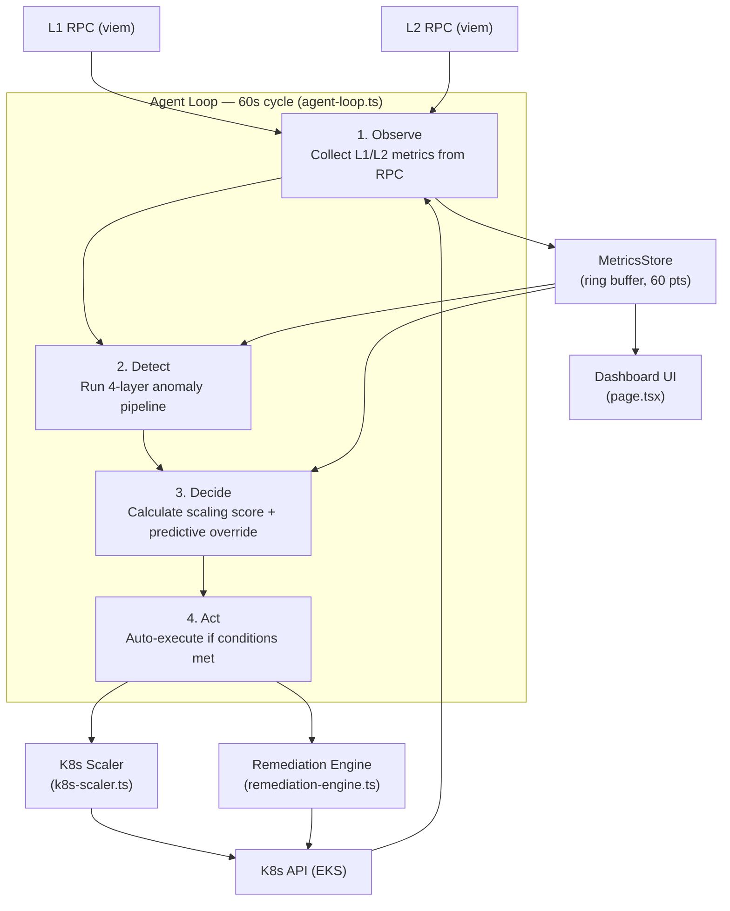
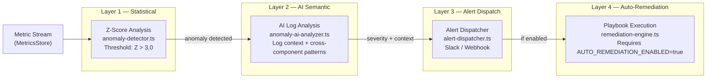
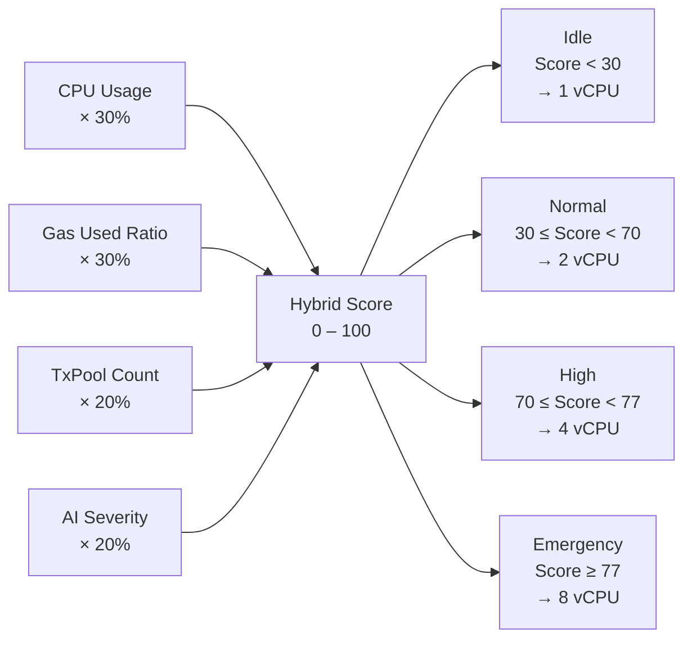
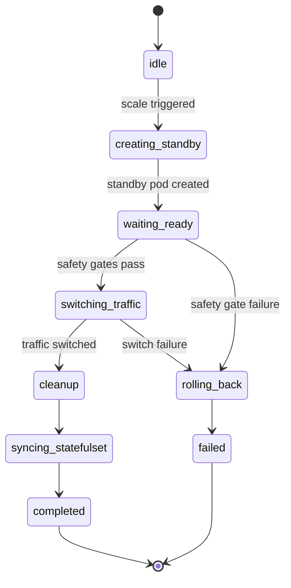
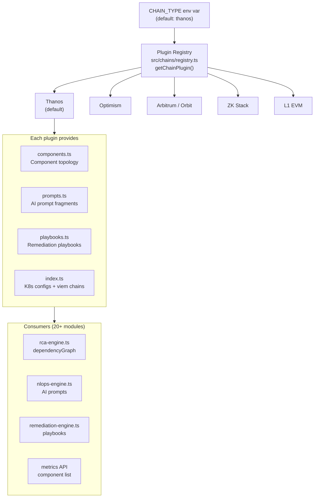
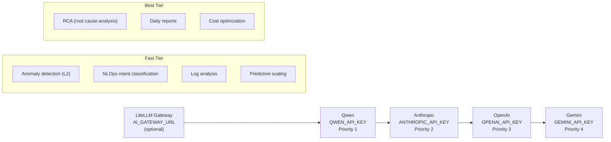

# SentinAI Architecture

System architecture and component interactions for autonomous L2/Rollup operations.

---

## High-Level Data Flow



The Agent Loop runs server-side every 60 seconds with no browser dependency. It is enabled automatically when `L2_RPC_URL` is set; override with `AGENT_LOOP_ENABLED=true|false`.

---

## 4-Layer Anomaly Detection Pipeline



**Layer 1** computes Z-scores over the 60-point ring buffer (mean, stdDev). Threshold `Z > 3.0` generates an anomaly event.

**Layer 2** passes anomaly metrics and recent logs to an AI model for semantic cross-component pattern analysis — detecting non-obvious causal chains (e.g., L1 RPC lag causing batcher backpressure).

**Layer 3** dispatches alerts to configured Slack or webhook endpoints via `ALERT_WEBHOOK_URL`.

**Layer 4** selects and executes a playbook via `playbook-matcher.ts` and `action-executor.ts`. Gated by `AUTO_REMEDIATION_ENABLED=true` (default: `false`).

---

## Hybrid Scoring and Scaling Tiers



A 5-minute cooldown (`SCALING_COOLDOWN_SECONDS=300`) prevents oscillation between tiers. Simulation mode (`SCALING_SIMULATION_MODE=true`, default) logs decisions without making real K8s changes.

### Scaling Mode Priority

`k8s-scaler.ts` attempts each mode in order, falling back on failure:

1. **Simulation** — Log only (default)
2. **In-Place Resize** — `kubectl patch pod --subresource resize` (K8s 1.27+, ~1–3s, zero downtime)
3. **Zero-Downtime Pod Swap** — State machine (see below)
4. **Docker** — Container restart with new resource limits
5. **Legacy kubectl patch** — Deployment spec update

---

## Zero-Downtime Pod Swap State Machine



**Safety gates** (evaluated in `waiting_ready`):

| Gate | Condition | Config |
|------|-----------|--------|
| Block Sync | Standby block height gap ≤ max | `ZERO_DOWNTIME_MAX_BLOCK_GAP` (default: `2`) |
| TX Drain | `txpool_status` pending + queued → 0 | `ZERO_DOWNTIME_TX_DRAIN_TIMEOUT_MS` (default: `60000`) |

If either gate fails or any state transition errors, the machine transitions to `rolling_back` and the original pod is restored.

---

## Chain Plugin Architecture



Adding a new chain requires 4 files under `src/chains/<chain>/`: `components.ts`, `prompts.ts`, `playbooks.ts`, `index.ts`. The registry lazy-loads plugins — only the active chain's code is imported at runtime.

---

## AI Client Priority



### AI Model Reference

| Priority | Provider | Fast Model | Best Model |
|----------|----------|------------|------------|
| 0 | LiteLLM Gateway | (provider-detected) | (provider-detected) |
| 1 | Qwen | `qwen3-80b-next` | `qwen3-80b-next` |
| 2 | Anthropic | `claude-haiku-4-5-20251001` | `claude-sonnet-4-5-20250929` |
| 3 | OpenAI | `gpt-5.2` | `gpt-5.2-codex` |
| 4 | Gemini | `gemini-2.5-flash-lite` | `gemini-2.5-pro` |

Every AI feature has a non-AI fallback path — the system degrades gracefully if no API key is configured.

---

## L1 RPC Failover

`l1-rpc-failover.ts` monitors L1 RPC health and automatically rotates endpoints:

- **Trigger**: ≥ 3 consecutive failures on the current endpoint
- **Action**: Switch to the next URL in `L1_RPC_URLS` (comma-separated list)
- **Cooldown**: 5 minutes per endpoint before retry
- **K8s propagation**: Updates downstream components via `kubectl set env`
- **Proxyd**: If `L1_PROXYD_ENABLED=true`, also updates the Proxyd ConfigMap

Fallback for single-endpoint setups: `SENTINAI_L1_RPC_URL` (defaults to publicnode.com).

---

## RCA Engine

`rca-engine.ts` traces fault propagation using the active chain plugin's `dependencyGraph`. The graph encodes which components depend on which (e.g., op-batcher depends on op-node, op-node depends on L1 RPC). When an anomaly is detected, the engine walks the graph to identify upstream root causes rather than treating each symptom independently.

**RCA output schema:**
```json
{
  "rootCause": "Derivation lag: op-node falling behind L1",
  "affectedComponents": ["op-node", "op-batcher"],
  "riskLevel": "high",
  "actionPlan": "Increase op-node CPU; verify L1 RPC health"
}
```

---

## NLOps Chat Interface

`nlops-engine.ts` exposes a natural language operations interface with:

- **9 AI function-calling tools**: metrics lookup, scaling, RCA trigger, remediation, cost analysis, log search, config query, EOA balance, component restart
- **7 intent types**: query, scale, diagnose, remediate, cost, config, status
- **Safety gate**: Dangerous actions (`scale_node`, `update_config`) require explicit user confirmation before execution

---

## State Management

`state-store.ts` defines an abstract interface with two implementations:

| Mode | Implementation | When Used |
|------|---------------|-----------|
| In-Memory | Default | Single instance, no `REDIS_URL` |
| Redis | `redis-state-store.ts` | Multi-instance, `REDIS_URL` set |

The MetricsStore ring buffer holds 60 data points per metric and computes rolling statistics (mean, stdDev, trend, slope) used by both the detection pipeline and the predictive scaler.

---

## API Routes

| Route | Methods | Purpose |
|-------|---------|---------|
| `metrics/route.ts` | GET | L1/L2 blocks, K8s pods, anomaly pipeline |
| `scaler/route.ts` | GET/POST/PATCH | Scaling state + AI prediction / execute / configure |
| `anomalies/route.ts` | GET | Anomaly event list |
| `nlops/route.ts` | GET/POST | NLOps chat |
| `rca/route.ts` | GET/POST | Root cause analysis |
| `remediation/route.ts` | GET/POST/PATCH | Remediation execution and status |
| `agent-loop/route.ts` | GET | Agent loop status and control |
| `eoa-balance/route.ts` | GET/POST | EOA balance status / refill |
| `mcp/route.ts` | GET/POST | MCP tool execution |
| `health/route.ts` | GET | Docker healthcheck |

---

## Deployment

Docker container only — **Vercel/serverless not supported** (requires `kubectl` + `aws` CLI at runtime).

3-stage Dockerfile: `deps` → `builder` → `runner` (node:20-alpine). Healthcheck: `GET /api/health`.

### Local Development
```
Docker Compose
├── sentinai (Next.js, port 3002)
├── redis (optional, port 6379)
└── Local L2 RPC (optional, port 8545)
```

### Production (AWS EKS)
```
AWS EKS Cluster
├── sentinai Deployment
├── Redis StatefulSet (optional)
├── L2 RPC (external, load-balanced)
└── IAM Role (EKS read/write permissions)
```

---

## Security Model

- **API key auth**: Required for write endpoints (`SENTINAI_API_KEY` via `x-api-key` header)
- **Simulation mode**: `SCALING_SIMULATION_MODE=true` by default — no real K8s mutations
- **NLOps confirmation gate**: Dangerous operations require explicit user approval
- **AWS IAM**: EKS cluster access uses least-privilege IAM roles
- **Audit trail**: All actions logged with timestamp, decision reasoning, and outcome (Redis or in-memory, last 100 events)

---

## Tech Stack

| Layer | Technology |
|-------|-----------|
| Framework | Next.js 16, React 19 |
| Language | TypeScript (strict) |
| Blockchain RPC | viem |
| Charts | Recharts |
| Styling | Tailwind CSS 4, Lucide icons |
| Testing | Vitest |
| State (optional) | ioredis |

---

For implementation details, see:
- [API Reference](api-reference.md)
- [MCP User Guide](sentinai-mcp-user-guide.md)
- [Testing Guide](../verification/testing-guide.md)
